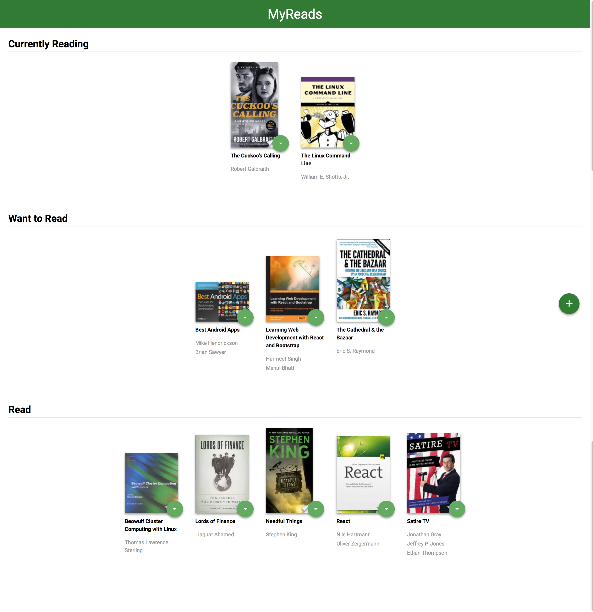
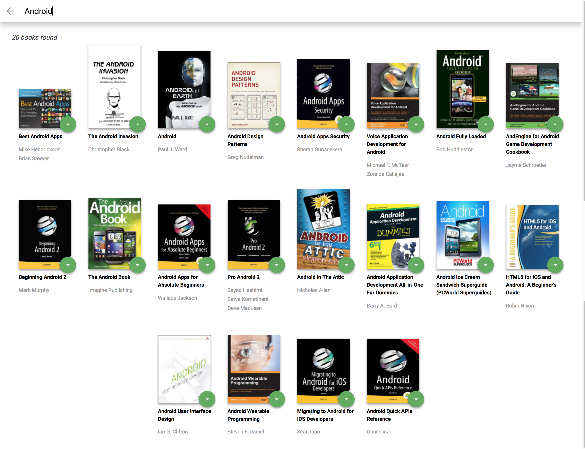

# MyReads Project

This is the seventh required project on the [Udacity Front End Nanodegree](https://eu.udacity.com/course/front-end-web-developer-nanodegree--nd001).

The goal of this project was to build a web application using [React.js](https://reactjs.org/), as well as an API server and client in order to persist information as the user interacts.

## What is it

*MyReads* is a web application that allows you to select and categorize books. The main page displays a list of "shelves" (categories), each of which contains a number of books. The three shelves are:

* Currently Reading
* Want to Read
* Read

A book can be changed from a shelf to another one by selecting the new state (arrow icon). If "none" is selected, the book will disappear from the main page.

The application also has a search page that allows users to find books. This search may have some limitations (see [notes](#notes) section).

## React components

The following scheme shows how React components are structured:

```bash
<App/>
├── <MainPage/>
└── <SearchPage/>

<MainPage/>
├── <BookShelf />
├── <BookShelf />
└── <BookShelf />

<BookShelf />
├── <Book />
├── <Book />
├── <Book />
│ ...
└── <Book />

<SearchPage/>
├── <SearchBar />
├── <Book />
├── <Book />
│ ...
└── <Book />
```

## How to run

1. Download [⬇](https://github.com/BycorSanchez/my-reads/archive/master.zip) or clone this repository.
`git clone https://github.com/BycorSanchez/my-reads.git`
2. Install project dependencies with `npm install`.
3. Start the server with `npm start`.
4. Visit `http://localhost:3000`.

## Technologies used

* [React.js](https://reactjs.org/)
* [react-router](https://github.com/ReactTraining/react-router)
* [prop-types](https://github.com/facebook/prop-types)
* [sort-by](https://github.com/kvnneff/sort-by)
* Books API (provided by Udacity)

### Notes

The backend API uses a fixed set of cached search results and is limited to a particular set of search terms, which can be found in [SEARCH_TERMS.md](SEARCH_TERMS.md).

Most of the code in this project has been written to the ES6 JavaScript specification for compatibility with modern web browsers and future proofing JavaScript code.

----

----
